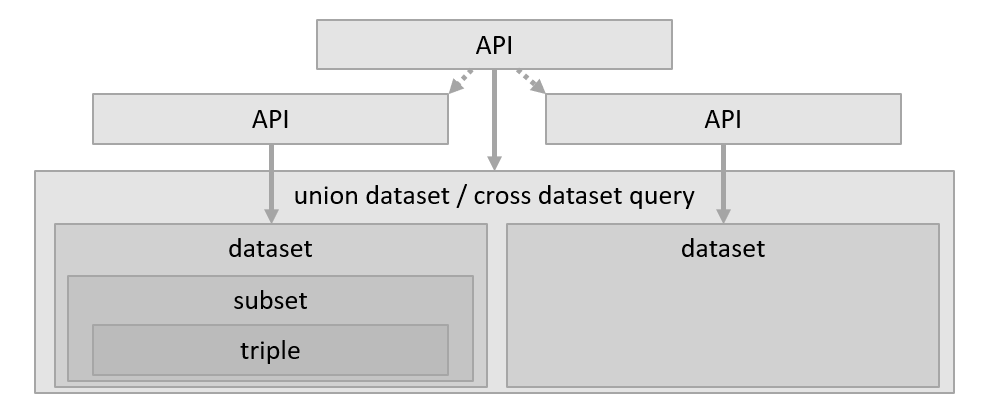

In beginsel is autorisatie eenvoudig: iemand wil bij iets en de vraag is of dat mag.

Was het maar zo gemakkelijk.

- _‘iemand’_ betekent dat bekend moet zijn wie diegene is. Dit vraagt om identificatie,
  identificerende gegevens, identiteiten. Het proces om dit te verifiëren heet authenticatie en dat
  is een onderwerp op zich. 
- Het _‘iets’_ betekent ‘een resource’. Dat kan een hele dataset zijn, bijv. een basisregistratie
  als BAG, BGT of BRK. Het kan ook een specifieke selectie zijn uit een dataset of een selectie uit
  de combinatie van meerdere datasets. Dat _‘iets’_ is al snel complex.
  
Veel gehanteerde termen zijn _‘subject’_ voor _‘de iemand die de vraag stelt'_. _‘Resource’_ wordt
gebruikt voor het _‘iets dat opgevraagd wordt’_. De autorisatie wordt bepaald door _‘policies’_, de
voorwaarden, waaronder het subject toegang krijgt of niet. Deze gaan uit van een _‘context’_ waarin
de _‘rollen’_ van het _‘subject’_ en extra informatie op basis van het _‘request’_, de vraag, kunnen
worden meegenomen in de afweging. Deze terminologie is formeel vastgelegd in
[XACML](../achtergrond/xacml.md). 

## Subject

Een subject kan een gebruiker zijn en ook een machine (computer). Afhankelijk van het type bestaan
er verschillende soorten van identiteiten.

Gebruikers worden meestal beheerd in een ‘User Management System’, welke weer gevoed kan worden door
een HR systeem. Daarin worden meestal ook functies en rollen bijgehouden en uitgegeven door de
beheerorganisatie over wat ‘iemand mag’. Een gebruiker heeft dan een ‘username’ (en wachtwoord) en
een set aan rollen. Een geautoriseerd persoon geeft toestemming en legt verantwoording af over de
rechten (rollen) van een gebruiker.

Machines worden vaak dmv certificaten of (API) ‘keys’ (sleutels) geïdentificeerd. Deze zijn
uitgegeven door een autoriteit en zijn geautomatiseerd te controleren.

Zowel gebruikersaccounts als sleutelbeheer zijn complexe beheersprocessen waarin vele lagen van
(verborgen) complexiteit zitten, zoals het kunnen intrekken, delegeren, verschillende niveaus van
vertrouwen passend bij de verschillende niveaus van betrouwbaarheid die nodig is, etc, etc.

<b>Out of scope</b> 
Voor het Lock-Unlock project hebben we het onderdeel 'Subject' en ook het proces van authenticatie
aangenomen als beschikbaar. Dat is er. Dat bestaat gewoon. Dit is absoluut niet het geval en er
valt juist heel veel over te zeggen. Maar voor de scope van dit project is dat niet relevant. Op
enig manier wordt een user of machine geïndentificeerd en dat vindt plaats <i>vóórdat</i> het onderdeel
autorisatie komt. Dit laatste is juist het onderwerp van onderzoek voor Lock-Unlock.

## Autorisatie

Autorisatie is de controle en het proces van toegang geven tot een Resource. Het doel van
autorisatie is dat alleen vastgestelde toegang verleend wordt aan Subjecten. Dat is een proces van
afscherming _vóóraf_. Dit is het onderwerp van onderzoek voor het Lock-Unlock project en komt nog
uitgebreid aan bod. 

Het doel van autorisatie, zeker in de context van de overheid, is te garanderen dat deze toegang
rechtmatig is. Dat wil zeggen dat er een **juridische grondslag** is voor de toegang en/of
verwerking. Het blijkt echter onmogelijk om _volledig_ van tevoren te kunnen bepalen of de grondslag
voldoende is om toegang te kunnen verlenen. Dat heeft met name te maken met de gedeelde
verantwoordelijkheid van die toegang als dat een koppeling tussen twee organisaties betreft. De
enige mogelijkheid om de grondslag juist te kunnen controleren, is _achteraf_. In dat geval is
[auditing](#auditing) nodig op de toegang die gegeven is. Voorkomen is dan helaas niet meer
mogelijk, maar wel bijsturing en eventueel opvolging.

## Auditing

Zoals hierboven al gesteld, is het onmogelijk om van tevoren of bij de evaluatie om toegang te gaan
verlenen te bepalen of dat rechtmatig is. Dat is vooral in het geval als het een koppeling tussen
twee (of meer) organisaties betreft. De medewerker van de bevragende organisatie zal een juridische
grondslag moeten hebben om de bevraging te kunnen doen. Het is echter niet mogelijk voor de
leverende organisatie om te bepalen of die grondslag juist is en passend voor de situatie. Sterker
nog, het is onrechtmatig als de leverende organisatie precies weet voor welke casus de bevraging
wordt gedaan. Dat betekent dat er van tevoren afspraken gemaakt kunnen worden of de mogelijkheid dat
(medewerkers van) een organisatie de API van een andere organisatie gaan aanroepen en dát kan
gecontroleerd worden ten tijde van de bevraging. Dit is wat we autorisatie noemen. Voor de controle
op juiste grondslag per bevraging zijn we aangewezen op auditing.

Voor de auditing zijn beide partijen nodig en verantwoordelijk. De partij / organisatie van waaruit
de bevraging wordt gedaan, is verantwoordelijk voor het vastleggen van de relatie naar de specifieke
grondslag en specifieke casus waarvoor die grondslag zou moeten gelden en de medewerker die vanuit
die organisatie daarbij betrokken is. De partij / organisatie die bevraagd wordt, de leverende
partij, dient vast te leggen dat zij bevraagd zijn door de vragende partij en voor welke resource
dat precies was. Om dmv een audit de relatie tussen beide verslaglegging te kunnen doen, wordt er
vanuit de bevragende partij een `transaction referentie` (of `id`) meegegeven die in beide
verslagleggingen dient te worden bewaard. Deze verslaglegging wordt ook wel 'logging' genoemd.

Er bestaat een standaard in wording voor dit patroon en toepassing:
[Verwerkingenlogging](../achtergrond/verwerkingenlogging.md)

## Resource

Over de 'Resource' valt veel te zeggen ... en deze bepaalt ook veel van een oplossingsrichting en/of
complexiteit. In de [desk research](../index.md#desk-research) besteden we uitgebreid aandacht aan
diverse variaties. In deze samenvatting beperken we ons tot het benoemen dat een resource kan zijn:

- een tabel
- een dataset
- een database
- een API (zie ook [API's | REST vs GraphQL vs SPARQL](../federatieve-bevraging/apis.md))
- een triple
- een graph
- een combinatie van bovenstaande

> _Zie ook de [glossary](../achtergrond/glossary.md) voor de verschillen tussen dataset, subset, database, graph en subgraph_

