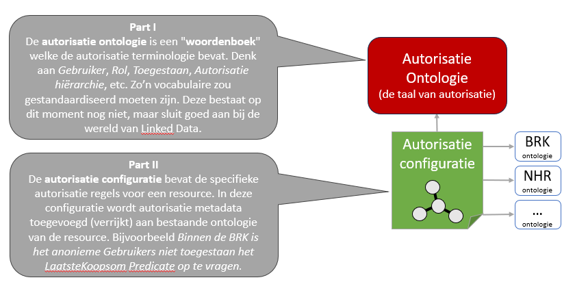
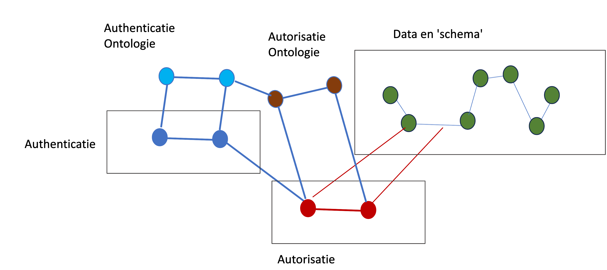

# Concept 'Autorisatie als Linked Data'

Binnen dit project wordt een configureerbare autorisatie component voorgesteld die een beveiligd
SPARQL endpoint opricht. Alle SPARQL queries kunnen gesteld worden maar op basis van de autorisatie
worden alleen de resultaten terug gegeven die de gebruiker mag zien. Op deze manier kan er een
netwerk van triplestores gemaakt worden die eigen autorisatiegegevens bevat.

|  .  |
| :--------------------------------: |
| Netwerk van beveiligd triplestores |

Applicaties kunnen de SPARQL endpoints gebruiken en dus ook meerdere SPARQL endpoints via de
federatieve mogelijkheden die SPARQL biedt. Een dergelijke oplossing zou als een extra component
toegevoegd kunnen worden aan bestaande triplestores zonder extra eisen aan deze triplestore te
stellen. Door de instandhouding van een SPARQL endpoint voldoet een dergelijke implementatie ook aan
de Linked Data architectuur. Applicaties die werken met een SPARQL endpoint zouden gewoon moeten
werken. 

|      |
| :-----------------------------------: |
| Autorisatie ontologie en configuratie |

Configuratie mogelijkheden van de autorisatie zorgt ervoor dat er 1 implementatie kan ontstaan die
voor (alle) endpoints data kan afschermen. Deze configuratie biedt meerdere mogelijkheden om data af
te schermen en kan "geinstantieerd" worden op basis van een autorisatie ontologie. Deze ontologie
beschrijft data-afschermingsmogelijkheden en bevat de minimale kenmerken die nodig zijn om alle
informatie hiervoor op te slaan. 

Wat er precies afgeschermd dient te worden kan geconfigureerd worden door o.a. gebruik te maken van
Linked Data modellen (schemas of ontologieën) en linked datasets (autorisatieregels beschikbaar
gemaakt als linked data). Oftewel de autorisatie configuratie maakt gebruik van de Linked Data
modellen die de Linked Data datasets beschrijven.

|                               |
| :--------------------------------------------------------------------: |
| Autorisatie ontologie in samenhang met authenticatie en instantie data |

### Samenvatting

Samengevat zijn de hoofduitgangspunten voor het concept Autorisatie als Linked Data zijn: 

- Autorisatieregels zijn vastgelegd in Linked Data op basis van een autorisatie ontologie
- Autorisatieregels zijn beschrijven in RDF format en geinstantieerd op basis van de autorisatie
  ontologie
- Een autorisatie implementatie gebruikt de autorisatie-regels en dat is voldoende voor een
  volledige implementatie
- Een autorisatie implementatie zit achter een SPARQL endpoint zodat alle Linked Data standaarden intact blijven
