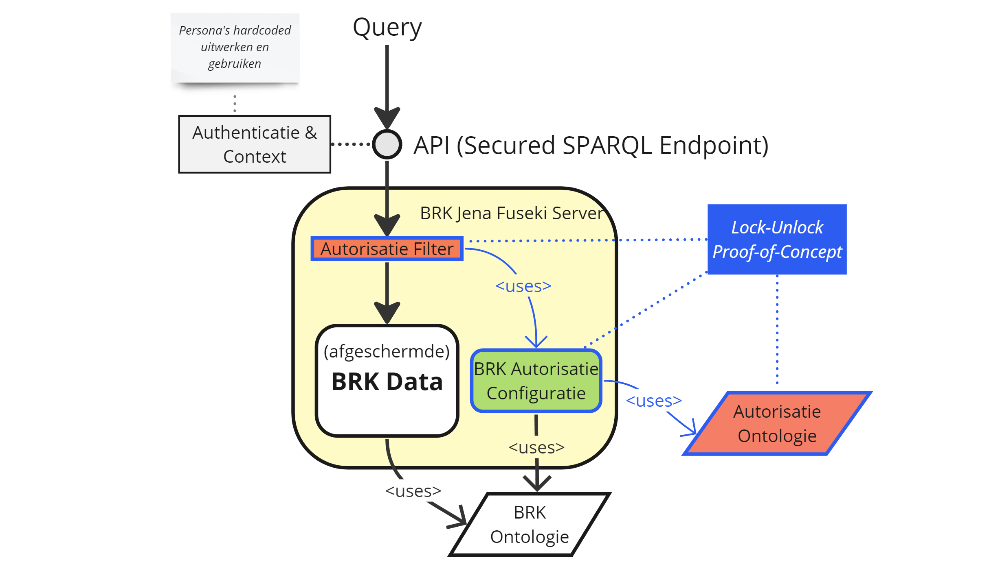

De autorisatie kennisgraaf beschrijft declaratief op basis van de autorisatie ontologie wie welke
rechten heeft op welke gegevens in de dataset. Deze declaratieve data zou per definitie voldoende
moeten zijn om een implementatie te voorzien van de juiste gegevens zodat ook daadwerkelijk de
gegevens afgeschermd kunnen worden. Hoewel dit niet verder is uitgewerkt in dit project zou je deze
autorisatie kennisgraaf ook moeten kunnen gebruiken om een set van API's, die per API zeer specifiek
toegang geven tot een subset van de informatie, af te schermen. 

Om SPARQL endpoints te beveiligen op basis van de kennisgraaf zijn er verschillende implementaties
mogelijk. Hierbij is onderscheid te maken tussen een implementatie op basis van de (bron)code van
een triplestore die SPARQL queries uitvoert en een implementatie die voor een bestaande triplestore
gezet kan worden als losse service. Het wijzigen van de broncode van een triplestore is nogal
vergaand (hoewel na standaardisatie dat voor alle triplestores toegepast zou moeten worden; zie ook
de [aanbevelingen](../../conclusies.md#implementaties-doorontwikkelen)).

In dit project is gekozen voor het ontwikkelen van een extra filter in een open source service.
Gekozen is voor het <a href="https://jena.apache.org/" target="_blank">Apache Jena</a> project als
basis. Vervolgens hebben we daarin een `AutorisatieFilter` toegevoegd, waarvan de code ook weer als
open source beschikbaar is gesteld; zie [opleveringen: Secured SPARQL
Endpoints](../../opleveringen.md#secured-sparql-endpoints).

|  |
| :------------------------------------------------------------: |
|              _Proof-of-Concept AutorisatieFilter_              |

Binnen dit project zijn er 2 implementatie strategieën geïdentificeerd en verder beproefd op basis
van een snelle PoC (Proof-of-Concept) implementatie. Beide zijn gebaseerd op Apache Jena en het
toevoegen van een extra filtering voor afscherming. De manier _waarop_ die filtering wordt
toegepast, zijn wel verschillende strategieën:

- **[SPARQL Rewrite](./rewrite.md)**: Bij deze strategie worden inkomende SPARQL queries herschreven
  zodat alle data afschermingen toegevoegd worden aan de query. 

- **[Subgraph](./subgraph.md)**: Hierbij wordt op basis van de autorisatie gegevens een subgraph
  gegenereerd van de data waartoe de gebruiker toegang heeft. Vervolgens wordt de originele query op
  deze subset uitgevoerd (ipv uitvoering op alle gegevens). 

Een samenvatting van de sterke en zwakke punten van beide concepten staat in [evaluatie van de twee
implementaties](../evaluatie.md#vergelijking-implementaties).
