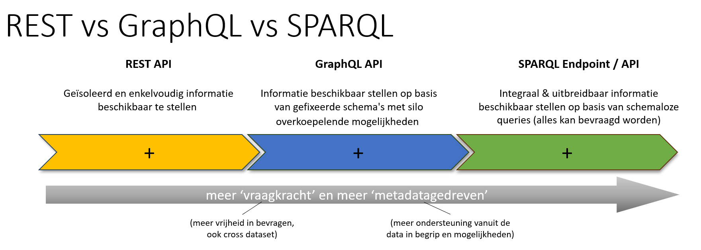

In de huidige stand van de techniek wordt met API meestal een **REST API** bedoeld, hoewel er vele
varianten van API's bestaan. Een REST API staat voor een API die gebruik maakt van internet
protocollen als TCP/IP en HTTP voor het bevragen. Er zijn echter ook andere API standaarden die
gebaseerd zijn op deze internet protocollen en in opkomst zijn, zoals **GraphQL** en **SPARQL**. Het
bestaan en de verschillen zijn relevant voor dit onderzoek. Hieronder worden deze verschillen
toegelicht.

#### REST 

[REST](https://roy.gbiv.com/pubs/dissertation/rest_arch_style.html) staat voor _Representational
State Transfer_ waarmee geduid wordt op een _Resource_. Met een REST API kan een Resource bevraagd
en (eventueel) ook gemuteerd worden en daarbij wordt (dus) gebruik gemaakt van de [HTTP
methods](https://www.rfc-editor.org/rfc/rfc9110.html#name-method-definitions) als GET, PUT en POST.
De data wordt in JSON formaat (JavaScript Object Notation) over HTTP uitgewisseld (transport) tussen
een client en de server. 

REST API’s/RESTful-webservices zijn opgezet om geïsoleerd en enkelvoudige informatie beschikbaar te
stellen. Elke API heeft één specifieke input en output. Relaties tussen objecten zijn in de (output)
JSON als URL opgenomen welke direct gebruikt kan worden om dan een gerelateerd object op te vragen.
Hoewel dit de REST API zeer geschikt maakt voor grote (bulk) en frequente, herhaalde verzoeken, zijn federatieve gegevensverzoeken met behulp van REST API's niet zo eenvoudig.
Daarvoor dient een client, de software voor uitvoeren van de bevraging, slim en flexibel te zijn.
Tot slot dienen de REST API's te voldoen aan de Restful standaarden, welke de facto standaarden zijn
en helaas slechts weinig echt ondersteund worden.

| Pros | Cons | 
|------|------|
| <ul><li>Zeer gangbaar</li><li>Binare autorisatie is gestandardiseerd</li></ul> | <ul><li>Silo gedachte</li><li>API orkestratie nodig voor samenhang</li><li>Slechte schema definities onsluiting</li><li>Geen vrije (schema loze) query mogelijkheden</li></ul> |

#### GraphQL

[GraphQL](https://spec.graphql.org/) is een query taal (bevragingstaal) voor API's. Het is een
nieuwe techniek welke sterk lijkt op een REST API wat betreft het resultaat, namelijk data in JSON
formaat. Echter waar REST een reeks endpoints gebruikt per object, gebruikt GraphQL een enkel
endpoint/gateway. Wat er opgevraagd kan worden en wat er geretourneerd wordt, is gepubliceerd in een
GraphQL schema. Daarbij is het mogelijk om in het bevragen een selectie te maken van welke data je
precies nodig hebt. Het is ook mogelijk om meerdere objecten te combineren, zolang dat volgens het
schema beschikbaar is. Met een GraphQL gateway is het mogelijk om meerdere schema's en endpoints te
bevragen, wat in de richting van een federatieve bevraging komt. GraphQL is daarmee flexibeler dan
REST API’s en maakt het mogelijk om integraal informatie beschikbaar te stellen.

| Pros | Cons | 
|------|------|
| <ul><li>Minder silo gedachte</li><li>Mogelijkheden tot samenhang</li><li>Verfijnde autorisatie mogelijk</li><li>Gangbaarde/bekender dan SPARQL</li></ul> | <ul><li>Matige schema definities</li><li>Geen vrije (schema loze) query mogelijkheden</li><li>Minder gangbaar dan REST</li></ul> |

#### SPARQL

[SPARQL](https://en.wikipedia.org/wiki/SPARQL) (uitspraak 'sparkle') is een standaard query taal en
protocol voor Linked (Open) Data op het web en voor RDF triple stores. SPARQL staat voor _'SPARQL
Protocol and RDF Query Language'_ en biedt gebruikers de mogelijkheid om informatie op te vragen van
databases of van elke resource die kan worden uitgedrukt in RDF (zie [Linked
Data](./linkeddata.md)). Ook SPARQL is gebaseerd op HTTP net zoals REST en GraphQL en met deze zeer
krachtige query taal is het inherent mogelijk om één of meerdere endpoints / API’s in samenhang te
bevragen. SPARQL is volledig gebaseerd op Linked Data en de mogelijkheden daarvan.

| Pros | Cons | 
|------|------|
| <ul><li>Geen silo gedachtes</li><li>Hoge samenhang</li><li>Zeer goede schema definities ontsluiting</li><li>Schemaloze query mogelijkheden</li><li>Linked Data zijn W3C Open Standaarden</li></ul> | <ul><li>Verfijnde autorisatie mogelijkheden moeten nog ontwikkeld worden</li><li>Minder gangbare oplossing onder developers</li><li>Data moet beschikbaar zijn als Linked Data</li></ul> |

Hieronder worden de verschillen tussen de verschillende interfaces gevisualiseerd.

|  |
| :--: |
|_Vergelijking van toegangs mogelijkhede over de drie verschillende application interfaces_ |

## Vergelijking API's

GraphQL is een mix tussen REST API’s en SPARQL. Het biedt vergelijkbare functionaliteiten als REST
API’s maar met meer mogelijkheden. Waar SPARQL volledig is gebaseerd op [Linked
Data](./linkeddata.md), voldoet GraphQL slechts ten dele aan (de) Linked Data (principes).
Bijvoorbeeld, in een SPARQL endpoint/API kunnen meerdere schema’s gecombineerd worden, terwijl bij
GraphQL slecht één expliciet schema van toepassing is.

|  |
| :--: |
|_Vergelijking van vraagkracht van APIs voor federatief bevraging_|

In het algemeen zijn er drie belangrijke gebruiksscenario's voor linked data via SPARQL endpoints, namelijk; (zoekmachine)vindbaarheid, data-analyse, de semantiek van de data. De belangrijkste use case voor het gebruik en de implementatie van linked data als aanpak is dataverkenning en/of -analyse, waarbij de eis van een semantisch rijke, ondubbelzinnige betekenis voor data vereist is en waar er enig potentieel is voor herbruikbaarheid in andere contexten. SPARQL endpoints bieden ongefilterde toegang tot alles wat beschikbaar is via dat endpoint – de gebruiker is vervolgens vrij om de gegevens op elke gewenste manier op te vragen en indien nodig groeperingen of filters op de gegevens aan te bieden. Deze flexibiliteit en zelfbediening is niet zo aanwezig in GraphQL omdat filters niet zo flexibel kunnen worden toegepast. Een GraphQL endpoint vereist doorgaans enige voorconfiguratie, omdat er al gedefinieerde queries of vragen zijn die de manier bepalen waarop de gebruiker met het endpoint kan communiceren. Bij SPARQL is deze voorconfiguratie niet nodig. In beide gevallen kunnen de prestaties worden opgelost door de manier waarop een query wordt gedefinieerd, en opnieuw betekent het verschil tussen GraphQL- en SPARQL-query's dat deze prestatieverbetering kan worden gedaan binnen de query zelf in SPARQL, en daarom meer door de gebruiker wordt geleid, terwijl dit anders zou zijn. gedaan worden op de backend van een GraphQL endpoint.
