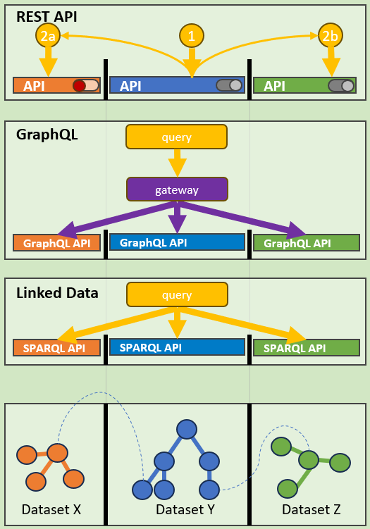

In een federatief datastelsel wordt data beschikbaar gesteld vanuit diverse bronnen. De toegevoegde
waarde volgt wanneer deze bronnen in samenhang bevraagd kunnen worden. Dit noemen we een
'federatieve bevraging'.

'Federatieve bevraging' duidt op twee onderdelen, namelijk de 'bevraging' en het feit dat dat
'federatief' plaatsvindt. We beschouwen dit vanuit een digitaal tijdperk en daarom betekent
'bevraging' een digitale of 'met computer' bevraging. Door de evolutie van de technologie heen wordt
het bevragen van een computer systeem aangeduid met een 'Application Programming Interface',
afgekort een **API** (uitspraak 'ee-pie-ai' of 'aapie').

In de huidige stand van de techniek wordt met API meestal een **REST API** bedoeld, hoewel er vele
varianten van API's bestaan. Er zijn echter ook andere API standaarden die gebaseerd zijn op deze internet
protocollen en in opkomst zijn, zoals **GraphQL** en **SPARQL**. Het bestaan en de verschillen zijn
relevant voor dit onderzoek en worden daarom beschreven op [API's | REST vs GraphQL vs
SPARQL](apis.md).

Hoewel in de huidige perceptie van 'een API' een REST API wordt bedoeld, is het _federatief_
bevragen met behulp van REST API's nog niet zo eenvoudig. Daarom is in (de opdracht voor) het Lock-Unlock project gekozen om uit te gaan van **[Linked Data](linkeddata.md)**. Dit is een concept en technologie waarmee data 'gelinkt' kan worden en
waarmee je kunt 'navigeren' over de data, over de 'nodes' in de data. De bijbehorende query taal
(bevragingstaal) is **SPARQL**. Daarmee is federatief bevragen inherent mogelijk!

In dit hoofdstuk wordt eerst beschreven hoe de verschillende API's zich tot elkaar verhouden en waarom we ons
beperkt hebben tot de scope van Linked Data.Vervolgens beschrijven we hoe het informatiemodel in elkaar zit en wat de relatie is tot de informatiekundige kern. Ook wordt toegelicht hoe de testdata is gegenereerd. Zowel het informatiemodel als de testdata is randvoorwaardelijk voor een goede testcasus en testopstelling. We sluiten af met conclusies rondom federatieve bevraging.

- [API's | REST vs GraphQL vs SPARQL](./apis.md)
- [Waarom Linked Data?](./linkeddata.md)
- [Informatiekundigekern](./informatiekundigekern.md)
    - Governance op informatiemodel, koppelsleutels, linksets
- [Testopstelling](./testopstelling.md)
    - Synthetische testdata genereren
    - Deployments & infrastructuur
- [Informatiemodel](./informatiemodel.md)
    - Relatie met IMX-Geo
    - Koppelsleutels: 2 opties (owl:SameAs vs directe uri’s)
- [Demonstrator](./demonstrator.md)
    - Mogelijkheden tot integraal bevragen data -> hier wil je dus autorisatie op toepassen
- [Conclusies](./conclusies.md)
    - (oa) Wat ervoor nodig om dit in de praktijk te krijgen?

