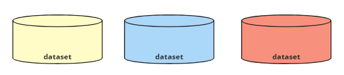
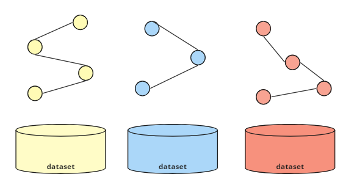
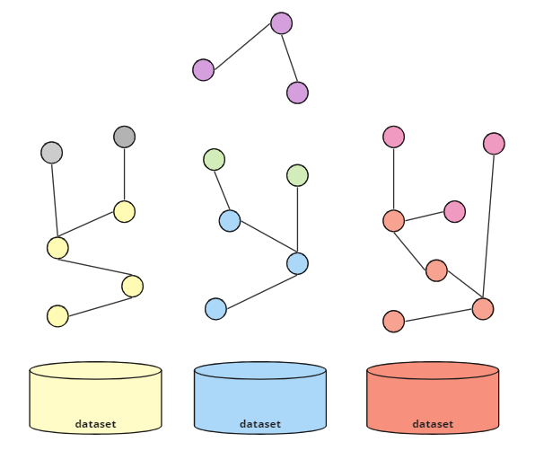
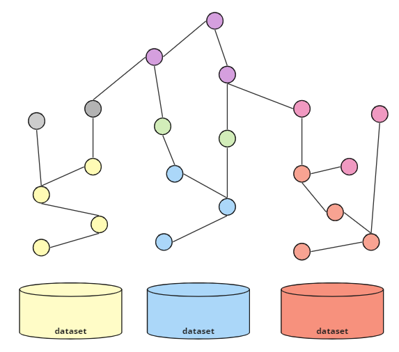
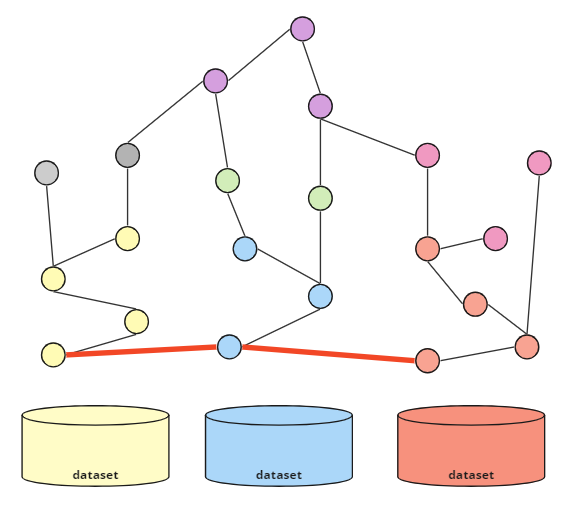

Een kernprincipe bij de ontwikkeling van het Federatief Datastelsel is het concept van een <a
href="https://realisatieibds.pleio.nl/groups/view/0056c9ef-5c2e-44f9-a998-e735f1e9ccaa/federatief-datastelsel/wiki/view/d0d90aeb-c896-4925-9948-35c6615ee873/notitie-informatiekundige-kern"
target="_blank">'informatiekundige kern'</a>. Deze informatiekundige kern ondersteunt het koppelen
van verschillende basisregistraties via gedefinieerde koppelsleutels; zie <a
href="https://www.digitaleoverheid.nl/overzicht-van-alle-onderwerpen/stelsel-van-basisregistraties/stelsel-van-basisregistraties-toegankelijke-beschrijving/"
target="_blank">Stelsel van Basisregistraties</a>. Deze geïdentificeerde relaties vertegenwoordigen
de relaties die het meest worden gebruikt bij het combineren van gegevens uit verschillende bronnen
voor een bepaald doel. Het idee is dat door deze 'kern' te formaliseren, gebruikers van de data deze
informatie gemakkelijker kunnen opvragen en kunnen combineren.

Omdat het startpunt voor het Lock-Unlock project de doorontwikkeling van het IGO project was, was
het gebruik van Linked Data technologie logisch voor dit project. Hoewel het project deze
technologieën gebruikt om gegevensbronnen te koppelen, is Linked Data technologie niet de enige
manier voor federatieve bevragingen. Andere oplossingen zijn echter niet verder onderzocht of getest
als onderdeel van dit project. De volgende discussie presenteert een stappenplan voor federatieve
bevragingen op basis van Linked Data. Bij fase drie worden ook verschillende opties voor het ontwerp
van een informatiekundige kern met behulp van Linked Data technologie geschetst. Eén van deze opties
is meegenomen in het ontwerp van het [informatiemodel](informatiemodel.md) voor dit project. 

Het is belangrijk op te merken dat, hoewel het informatiemodel en het gebruik ervan binnen dit
project, de toegevoegde waarde aantoont van geformaliseerde relaties voor het ondersteunen van
federatieve bevraging tussen informatiebronnen, het geen definitieve conclusies biedt over wat de
inhoud van de informatiekundige kern zou moeten zijn. Dit komt omdat de gegevens die voor dit
project werden gebruikt, aanzienlijk zijn vereenvoudigd om te voldoen aan de minimale vereisten van
de ontworpen demonstrators. Elk onderzoek naar de uitdagingen en randgevallen die van invloed zijn
op de complexiteit van het ontwerp van een informatiekundige kern vallen buiten de scope van dit
project.

### Ontwerp Federatief Datastelsel met Linked Data

Bij het ontwerp van een federatief datastelsel moet er rekening gehouden worden met losstaande
registraties die op enige manier met elkaar te verbinden moeten zijn (interoperabel). Linked Data
biedt daarin mogelijkheden en er zijn daar een aantal stappen in te beschrijven.

#### Stap 1. Onafhankelijke Registraties 
 
De basisregistraties (e.g. BRK, BAG, BRP en NHR) zijn relatief onafhankelijk van elkaar ontwikkeld
door verschillende organisaties, technieken en modellen. Zo beheert Kadaster bijvoorbeeld de BRK en
de KvK het NHR. Ook de modellering en standardisatie van de gegevens kan verschillen. Zo zijn,
bijvoorbeeld, de <a
href="https://www.geonovum.nl/geo-standaarden/nen-3610-basismodel-voor-informatiemodellen"
target="_blank">NEN3610</a> en Geonovum's IM-modellen de basis voor de datasets van Kadaster,
terwijl deze standaarden minder van belang zijn bij andere registers. Door de onafhankelijke
ontwikkeling van registers ontstaan zogenaamde data silo’s. Abstract wordt deze situatie als volgt
gevisualiseerd. 

|  |
| :-------------------------------------------------: |
|        *Registraties als losstaande silo's*         |

#### Stap 2. Registraties als Linked Data

De bron van alle registers is vooralsnog geen Linked Data. Een ontwikkeling naar Linked Data toe zou
kunnen door de bestaande situatie uit te breiden met een publicatie van de gegevens in Linked Data.
Er zijn steeds meer implementaties en standaarden aanwezig om Linked Data te genereren vanuit een
andere type bron zoals bijvoorbeeld een SQL database. Denk hierbij bijvoorbeeld aan <a
href="https://rml.io/" target="_blank">RML</a> of <a href="https://www.w3.org/TR/r2rml/"
target="_blank">R2RML</a>. Ook maakt <a href="https://www.w3.org/TR/json-ld11/"
target="_blank">JSON-LD</a> de stap naar Linked Data makkelijker voor implementaties die werken met
JSON; bijvoorbeeld JSON API's. Het volgende diagram toont de creatie van Linked Data silo's voor
elk van de oorspronkelijke gegevensbronnen.

|  |
| :---------------------------------------------------------: |
|     *Registraties beschikbaar gemaakt als Linked Data*      |

> _**4 Star Linked Data**: Omdat deze informatie nu als Linked Data wordt gepubliceerd met behulp
> van de verschillende open Linked Data-standaarden, kan deze informatie worden beoordeeld volgens
> het [5-sterrenmodel](./linkeddata.md#basis-principes). Op dit moment worden de individuele Linked
> Data-silo's beoordeeld als 4-sterren Linked Data. De volgende stappen in deze sectie verbeteren
> deze beoordeling._

Door middel van een SPARQL endpoint kan er nu een federatieve query gemaakt worden die gegevens uit
meerder endpoints raadpleegt. Om dit te kunnen doen, moet de gebruiker echter begrijpen waar de
overlappingen bestaan tussen verschillende datasets. D.w.z. hoe de informatie die zich in de ene
dataset bevindt kan worden verbonden met de informatie in de andere dataset zodat deze data
integraal opgevraagd kan worden.

#### Stap 3. Toevoegen van Context Binnen Registraties

Om precies te weten wat de data betekent en waar eventueel een overlap te vinden is die in meerdere
registers aanwezig is, kan de data verrijkt worden met een context. Elk data element (of stuk
instantie data) kan gekoppeld worden aan een Linked Data klasse (bv. een `owl:Class`) die o.a.
beschrijvingen, labels (in meerdere talen) en overige informatie kan bevatten. Door deze extra
context is de data beter te begrijpen en makkelijker te bevragen door de gebruikers. 

|  |
| :------------------------------------------------: |
|        *Beschikbaar maken van een context*         |

De toevoeging van een dergelijke context verschijnt in de vorm van of een schema dat is gedefinieerd
met behulp van Linked Data-standaarden of in de vorm van een geformaliseerde ontologie. Dit laatste
is alleen beschikbaar als de context formele logica omvat (bijvoorbeeld het gebruik van
[axioma](../achtergrond/glossary.md#axioma)'s) die
[inferentie](../achtergrond/glossary.md#inferentie) ondersteunt.

Met de toevoeging van een schema of ontologie aan de instantiegegevens kan de overlap tussen
verschillende registers voor gebruikers gemakkelijker te identificeren zijn. Dit kan gebaseerd zijn
op het gebruik van dezelfde klassen of attributen in meerdere registers (bijvoorbeeld de
aanwezigheid van BSN-nummers in zowel de BRK als de BRP) of op de mogelijkheid om geografische
(geospatial) overlap tussen objecten uit te voeren. Dit laatste is vaak nuttig bij het identificeren
van de relatie tussen georuimtelijke registers zoals de BAG en de BRK, waar de overlap tussen
gebouwen en percelen voor veel gebruikers van toegevoegde waarde is. 

Omdat deze overlappingen of schijnbaar gedeelde kenmerken nog niet als zodanig tussen registers zijn
geformaliseerd, moeten deze door gebruikers worden geïdentificeerd en onderzocht voordat een
federatieve query kan worden uitgevoerd. De relatie met andere registers is dus nog niet optimaal in
deze situatie. Het scala aan opties dat beschikbaar is voor gebruikers en de rol van de
informatiekundige kern bij de ondersteuning hiervan worden in de volgende stap besproken.

#### Stap 4. (Formele) Verbinding van Registraties

Het concept van een informatiekundige kern heeft affiniteit met Linked Data technologies vanwege de
inherente ondersteuning van Linked Data voor het koppelen van gedistribueerde gegevensbronnen. Wel
is het zo dat Linked Data meerdere mogelijkheden biedt voor het ondersteunen van federatieve
bevragingen. Indien er expliciet geen voorzieningen aanwezig zijn om de registers ge-coordineerd te koppelen kan er toch verbindingen ontstaan tussen de registers door gebruik te maken van Linked Data. Hieronder worden enkele mogelijkheden kort besproken.  

1. **Veldmatching op basis van koppelelementen:** Het is bijvoorbeeld goed mogelijk om meerdere
   bronnen federatief te bevragen zonder dat er een expliciete koppeling is tussen de bronnen. Wel
   moet er een gemeenschappelijke data-element zijn om te kunnen verbinden: denk hierbij aan naam,
   adres, bagID, KvK nummer, BSN, etc. Om dit te implementeren moeten instantiegegevens op basis van
   deze velden worden _gematcht_ (gebaseerd op de implementatie van een SPARQL-query), maar dit
   vereist dat de gebruiker van de gegevens deze velden kan identificeren.

2. **Toevoegen directe Links:** Zodra de velden zijn gematcht, kan een gebruiker besluiten de relaties tussen
   instantiegegevens te formaliseren. Door bijvoorbeeld de datasets te voorzien van extra context op
   basis van gestandardiseerde ontologieën zoals RDFS, OWL en SHACL kunnen de bestaande datasets
   verrijkt  worden met nieuwe data (relaties tussen instantie data). Deze nieuwe data kan ook
   leiden tot koppelingen tussen de gedistribueerde gegevensbronnen. Om gebruikers te ondersteunen
   bij het bevragen van gegevens uit verschillende bronnen, kunnen data-aanbieders ervoor kiezen
   deze relaties zelf te materialiseren door deze relaties op dezelfde manier toe te voegen, oftewel
   te materialiseren. Dit vereist uiteraard de ontwikkeling van overeenkomsten tussen
   data-aanbieders waar federatieve data bestaan, maar leidt tot meer zekerheid in deze
   gematerialiseerde relaties dan wanneer een gebruiker deze zelf moet implementeren. Zodra er een
   directe koppeling is gemaakt, is het eenvoudiger om federatief bevragen te stellen.

3. **Herbruik van URIs:** Indien Linked Data sets aanwezig zijn (zoals bijvoorbeeld Kadaster data) dan kunnen andere bronnen deze URI's gebruiken in eigen datasets. Zo kan bijvoorbeeld de NHR voor de 'zetel' van een KVK Inschrijving direct doorverwijzen naar een BAG uri van Kadaster. Daarmee zijn de 2 datasets gekoppeld op basis van URI's. Linked data is zeer geschikt om op deze manier verschillende datasets te koppelen en wellich is LD hiervoor ontworpen <a
href="https://5stardata.info/" target="_blank">(zie 5 sterren-model).</a>

4. **Description Logic:** <a href="https://www.w3.org/TR/owl2-overview/" target="_blank">OWL ontologieen</a> in Linked Data kunnen datasets verzoen van context waarbij afleidingen mogelijk zijn. Een simpel maar krachtig concept is bijvoorbeeld owl:sameAs. Hiermee kunnen resources in LD gelijk verklaard worden. Zo kan resource (denk aan een informatie object) A gelijk verklaard worden aan resource B. Korter opgeschreven A=B. Indien resource B=C, dan is een afleiding mogelijk:  A moet ook gelijk zijn aan C want A=B en B=C (dus A=C). Een Stichting 'A' uit AMBI kan bijvoorbeeld gelijk verklaard worden met Inschrijving uit de KVK (B). Kadaster kan een Persoon gelijk verklaren aan de KVK inschrijving 'C'. Afgeleid kan worden dat de Kadaster persoon nu gelijk is aan de stichting in AMBI. Oftewel door formele relaties te leggen tussen datasets kan er meer data afgeleid worden dat tot meer verbindingen kan leiden. OWL ontologieen hebben meerdere mechanismen hiervoor en de mogelijke afleidingen hiervan zijn gestandardiseerd.   

Met deze opties kunnen data-aanbieders hun data eenvoudig beschikbaar stellen als
Linked Data en kunnen gebruikers de relaties tussen data binnen en buiten hun datasets onderzoeken
en zelf definiëren. Theoretisch kunnen data-providers stappen 1 tot en met 3 volgen en het daarbij laten. Wel is het natuurlijk zo dat wanneer je gekoppeld bent met andere data dat je wellicht wensen en eisen hebt mbt deze link. Zo wil je bijvoorbeeld eisen stellen aan de beschikbaarheid van de data in de ander bron. Tevens wil je natuurlijk (minimaal) op de hoogte zijn van structuur veranderingen van de bronnen waarmee je gekoppeld bent, etc.

Het concept van de informatiekundige kern is om de koppeling tussen de registers te faciliteren door o.a. het formaliseren van <a href="https://realisatieibds.nl/attachment/entity/4d694095-b0e1-40d8-bd0e-6be013c9b455" target="_blank">identificerende gegevens.</a> 

Wellicht zou dit kunnen door een zogenaamde 'upper-ontologie' in LD  waarbij bijv relaties tussen registers expliciet gemaakt worden en deze beschikbaar zijn voor gebruikers. Een dergelijke ontologie zou wellicht een bijdrage kunnen leveren aan de adoptie van LD bij de registers. Bij deze aanpak is er ook een reeks opties met verschillende niveaus van betrokkenheid, hoe deze relaties explicieter kunnen worden gemaakt.

Idealiter zorg je voor formele koppelelementen die de registers adopteren en onderhouden. Hiervoor zijn weer meerdere mogelijkheden aanwezig zoals bijv:

-  **upperontologie voor koppelelementen**,
-  **gematerialiseerde relaties** tussen instantiegegevens over verschillende
registers heen
- **een kernmodel voor alle registers in de vorm van een upperontologie**

Deze opties worden hieronder kort beschreven en sluiten elkaar niet uit.

##### Optie 1: Upperontologie voor koppelelementen

Een [upperontologie](../achtergrond/glossary.md#upperontologie) definieert klassen en/of attributen
die worden gedeeld tussen verschillende registers. Een (minimale) upperontologie zou bijvoorbeeld het
attribuut BSN-nummer kunnen definiëren als het identificatienummer van een persoon en zowel de BRP
als de BRK kunnen dit attribuut gebruiken bij het publiceren van identificatiegegevens gerelateerd
aan personen. Deze gedeelde kenmerken kunnen worden aangeduid als sleutelvelden. 

|                   |
| :-----------------------------------------------------------------: |
| *Upperontologie beschikbaar gemaakt voor een bepaald set registers* |

Een dergelijke upperontologie kan logisch worden gedefinieerd op basis van geïdentificeerde
sleutelvelden, maar om dit op een nuttige manier te kunnen implementeren voor gebruikers moeten de
registers deze upperontologie en de bijbehorende afspraken ook adopteren. Door in beide registers
hetzelfde attribuut te gebruiken dat in de upperontologie is gedefinieerd, kunnen gebruikers van
deze gegevens er zeker van zijn dat het BSN-nummer in beide registers op dezelfde manier wordt
gebruikt. Wanneer een identifier in het ene register overeenkomt met een identifier in een ander
register, dan weet je zeker dat deze verwijst naar dezelfde persoon in de BRP.

|                            |
| :--------------------------------------------------------------------------: |
| *Linked data registers gecombineerd door het gebruik van een upperontologie* |

Hiermee wordt het makkelijker om data uit één register te combineren met data uit een ander
register. Bij het schrijven van een federatieve query kan dit BSN-nummer dus worden gebruikt om
informatie over de percelen van een bepaalde persoon op te halen bij de BRK en de persoonsgegevens
van deze persoon (bijvoorbeeld volledige naam, geboortedatum en huwelijksstatus) uit de BRP te
halen. 

##### Optie 2: Gematerialiseerde Relaties 

Het is ook mogelijk om extra relaties af te leiden bijvoorbeeld op basis van bovenstaande upperontologie. Deze relaties zou je evt kunnen 'materialiseren'. Oftewel extra
relaties kunnen (evt virtueel) toegevoegd worden. Deze materialisatie van relaties zorgt voor een directe verbinding tussen de instantiegegevens in verschillende registers; zie rode
lijnen in onderstaande afbeelding.

|    |
| :--------------------------------------------------: |
| *Materialiseren van extra relaties tussen registers* |

Het materialiseren van relaties tussen registers is in verschillende scenario's logisch. Een
voorbeeld is het formaliseren van relaties tussen registers op basis van hun ruimtelijke relatie met
elkaar. Bijvoorbeeld de relatie tussen een `bag:Verblijfsobject` en de `brk:Perceel` waaraan dit
object gerelateerd is op basis van zijn ruimtelijke nabijheid (overlappende geometrie bijvoorbeeld).
Hoewel de relatie geografisch gemaakt kan worden, kan deze ook toegevoegd worden in één of beide
registers. In de praktijk kan de gebruiker door de introductie van deze geformaliseerde relatie zien
welke `bag:Verblijfsobjecten` bij een bepaald `brk:Perceel` horen, maar bij uitbreiding ook welke
adressen (`bag:Nummeraanduiding`) bij het perceel horen.

Een tweede voorbeeld is de materialisatie van relaties tussen instantiegegevens op basis van
attributen vastgelegd in de upperontologie. Stel Kadaster legt eigendom van percelen van
rechtspersonen vast met o.a. een `kadaster:KVKnummer`. Indien dit `kadaster:KVKnummer` als kenmerk
gelijk gesteld wordt aan een KVKnummer in de upperontologie die vervolgens ook gelijkgesteld is aan
`NHR:InschrijvingsNummer` dan zou je vanuit Kadaster percelen een directe relatie kunnen leggen naar
een NHR inschrijving. Hiermee ontstaan er dus directe relaties tussen de registers. 

De aanwezigheid van directe relaties tussen de registers maakt het nog makkelijker om federatieve
bevragingen te doen. Integrale bevragingen zijn hierbij mogelijk maar ook bevragingen mbt
consistentie zijn hierbij zeer makkelijk. Denk bijvoorbeeld aan de vraag: welke BAG-Panden zijn
onbekend bij Kadaster vanuit de NHR. Of vanuit de BRK: welke BRP personen zijn (on)bekend bij de
BRP. Deze queries geven inzicht in de consistentie van samenhangende registers. Het schrijven van
een dergelijke controle query is zeer eenvoudig. De uitvoering ervan zal natuurlijk qua performance
wel het nodige vereisen. Linked Data technologie maakt de introductie van deze directe relaties
tussen instantiegegevens eenvoudig en illustreert een duidelijk voordeel van het gebruik van deze
technologie ter ondersteuning van federatieve bevragingen.

##### Optie 3: kernschema
Het is natuurlijk ook mogelijk om een set van klasses, kenmerken en relaties af te spreken tussen de registers als een soort kernschema. Elk register zou een eigen extensie kunnen ontwikkelen maar vanwege de gedeelde kern met andere registers zijn de verbindingen tussen registers al gedefinieerd. Registers gebruiken elkaars uri's om op deze manier directe verbinden te leggen op instantie nivo.
Een verdere uitbreiding van het kernschema zou de registers ook kunnen helpen met het vinden van de juiste gegevens op basis van het kernschema. Voordat je gegevens kunt koppelen moet je natuurlijk wel de juiste gegevens kunnen vinden. Zo zal Kadaster graag personen willen kunnen vinden in de BRP op basis van bijv NAW en wellicht geboorte-datum en -plaats. Hiermee kan wellicht een URI of BSN nummer gevonden worden waarmee een directe verbinding gelegd kan worden. Het standardiseren via het kernmschema van kenmerken zoals NAW, geboorte-datum en -plaats zorgt voor een stabiel informatie model gegevens te vinden. 

### Ontwerp van de Informatiekundige Kern met Linked Data

Het ontwerp van een evt informatiekundige kern in Linked Data zou een upperontologie kunnen zijn met minimaal bijvoorbeeld afspraken over (gematerialiseerde) relaties tussen (basis)registraties (daar waar logische
relaties bestaan). Een zeer belangrijke voorwaarde is natuurlijk dat de registers een Linked Data versie van hun gegevens ontwikkelen, publiceren en afschermen waar dat nodig is. De adoptie van Linked data door de registers kan wellicht versneld worden door een informatiekundige kern in Linked Data. Een informatiekundige kern in LD kan voor extra aandacht van LD zorgen, kan tot een kenniscentrum leiden voor registers die gegevens in LD willen publiceren, en maakt natuurlijk federatieve bevragingen mogelijk.

 moeten afspraken worden gemaakt tussen de beheerders van de basisregistraties
bij het ontwerpen van een dergelijke hogere ontologie en bij het onderhouden van eventuele
gematerialiseerde relaties tussen de basisregistraties. Door ervoor te zorgen dat deze afspraken
worden nageleefd, kan de gebruikstoegankelijkheid en herbruikbaarheid van de basisregistraties als
datastelsel worden gewaarborgd.

De [testopstelling](./testopstelling.md) biedt enige demonstratie van informatiekundige kern werking
in een federatieve bevraging, hoewel deze sterk vereenvoudigd is, zoals al beschreven in het
[informatiemodel](./informatiemodel.md).
