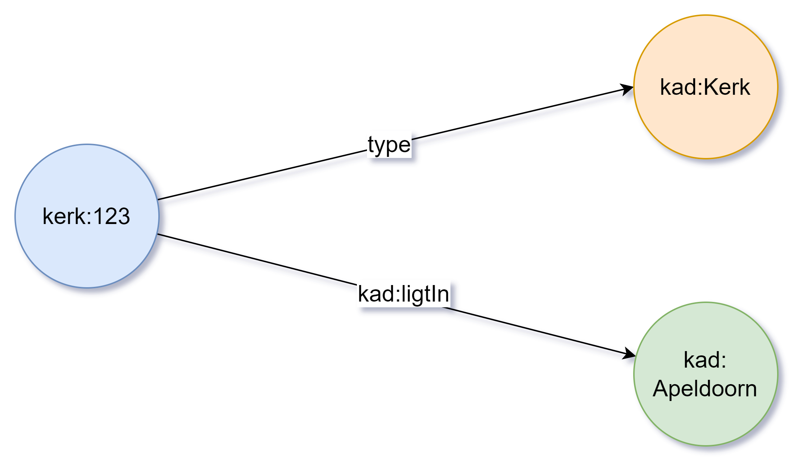
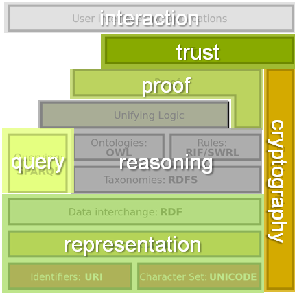

In de technologische en digitale evolutie is data steeds belangrijker geworden. Waar de eerste
automatisering gericht was op het automatiseren van processen en dus software, is in latere evolutie
de data tot een eigen aandachtsgebied geworden, naast de software. Daardoor is er meer aandacht en
nadruk gekomen voor semantiek en betekenis van de data. Al vanaf het eerste ontwerp van het web
bestaat het besef van resources met een uniek adres, een <a
href="https://nl.wikipedia.org/wiki/Uniform_resource_identifier" target="_blank">URI (Uniform
Resource Identifier)</a>, de meest herkenbare vorm hiervan is een URL. 

Het [Semantisch Web](https://nl.wikipedia.org/wiki/Semantisch_web) is een visie over een uitbreiding
van het bestaande World Wide Web, dat softwareprogramma's voorziet van machine leesbare metadata van
de gepubliceerde informatie en gegevens. Met andere woorden: we voegen verdere
gegevensbeschrijvingen toe aan anderszins bestaande inhoud en gegevens op internet. Binnen de
context van het Semantische Web zijn er twee belangrijke soorten data: **Linked Open Data (LOD)** en
**Semantische Metadata**.

Linked (Open) Data zijn gestructureerde gegevens, gemodelleerd als een graph en gepubliceerd op een
manier die het koppelen van gegevens tussen gedistribueerde bronnen ondersteunt. Tim Berners-Lee, de
grondlegger van het Semantic Web, definieert basisprincipes voor linked data:

- Gebruik URI's als namen voor dingen. **'Things instead of strings'**.
- Gebruik HTTP-URI's zodat mensen die namen kunnen opzoeken.
- Wanneer iemand een URI opzoekt, geef dan nuttige informatie, gebruik makend van de standaarden
  (RDF*, SPARQL).
- Voeg links naar andere URI's toe, zodat ze meer dingen kunnen ontdekken.

Deze ontdekking van nieuwe dingen wordt ondersteund door de publicatie van informatie in triple
formaat. Triples bestaan uit een _subject_, _predicate_ en een _object_. Bijvoorbeeld: 

||
|:-:|
| Triplestructuur |

Tevens zijn objecten in Linked Data uniek identificeerbaar op het web middels URIs. Een voorbeeld
van zoon sort URI in het Kadaster context is: 

<a href="http://bag.basisregistraties.overheid.nl/bag/id/pand/0003100000117485"
target="_blank">http://bag.basisregistraties.overheid.nl/bag/id/pand/0003100000117485</a> 

Elke triple wordt gedefinieerd als een <a
href="https://nl.wikipedia.org/wiki/Resource_Description_Framework"
target="_blank">RDF-statement</a>. Dit framework biedt een algemene methode voor het beschrijven en
uitwisselen van graph data en maakt daarmee een gestandaardiseerde uitwisseling van gegevens
mogelijk op basis van relaties tussen objecten op het web. 

### Linked Data Building Blocks

Er zijn dus een aantal building blocks voor het publiceren van gegevens als Linked Data:

1. Defineer data objects (resources) als HTTP-URIs
2. Gebruik de RDF framework om URIs te beschhrijven en meer informatie vastleggen
3. Definieer metadata (e.g. ontologien met formele logica) om de verbindingen tussen relaties vast
   te leggen
4. SPARQL beschikbaar maken en gebruiken voor bevragingen

De volgende figuren geven een concrete weergave van deze bouwstenen, de standaarden die de creatie
en publicatie van linked data ondersteunen en de manier waarop deze de gebruikersinteractie met de
resulterende data ondersteunen.

| **Standaarden** | **Utiliteit** |
|:-:|:-:|
|||

Source: Ongepubliceerde Lezing Linked data en Semantisch Web, University of Twente, <a
href="https://people.utwente.nl/l.o.boninodasilvasantos" target="_blank">Dr Luiz Bonino</a>

Voor het publiceren van volledig Linked Data (LOD) moet het <a
href="https://www.w3.org/2011/gld/wiki/5_Star_Linked_Data" target="_blank">5-star model</a> van W3C
gevolgd worden. Bij het publicatie van 5 star linked data vormt een basis voor data-gedreven
applicaties. Onze toepassingen hierop zijn in de volgende sectie uitgelegd. 

#### Gerelateerde Informatie

- Een internationale set van Linked Data standaarden is beschikbaar bij het <a
  href="https://www.w3.org/" target="_blank">W3C</a>
    - <a href="https://www.w3.org/wiki/LinkedData" target="_blank">W3C Linked Data</a>
    - <a href="https://www.w3.org/TR/rdf11-concepts/" target="_blank">W3C RDF 1.1 Concepts</a>
    - <a href="https://www.w3.org/TR/sparql11-query/" target="_blank">W3C SPARQL</a>

### Linked Data en Federatief Datastelsel

In een federatief datastelsel is semantiek en betekenis zeer van belang. Daarom is de toepassing van
Linked Data en het onderzoeken van de mogelijkheden daarvan voor de hand liggend. Het Kadaster heeft
daarvoor in het verleden al de <a href="https://labs.kadaster.nl/cases/integralegebruiksoplossing"
target="_blank">Integrale Gebruiksoplossing (IGO)</a> en de <a
href="https://labs.kadaster.nl/thema/Knowledge_graph" target="_blank">Kadaster Knowledge Graph
(KKG)</a> ontwikkeld.

Het Lock-Unlock project bouwt voort op de IGO en Linked Data en onderzoekt hoe 'gesloten data' of
'niet-open data' toch ontsloten kan worden. Dat betekent het stellen van voorwaarden aan de
bevraging en het expliciet afdwingen en controleren van de toegang. 

Dit is precies de kern van het Lock-Unlock onderzoeksproject: 

**_Lock de data, unlock het potentieel!_**

In de volgende secties wordt beschrijven hoe Linked Data in dit project werd toegepast en toegepast.
