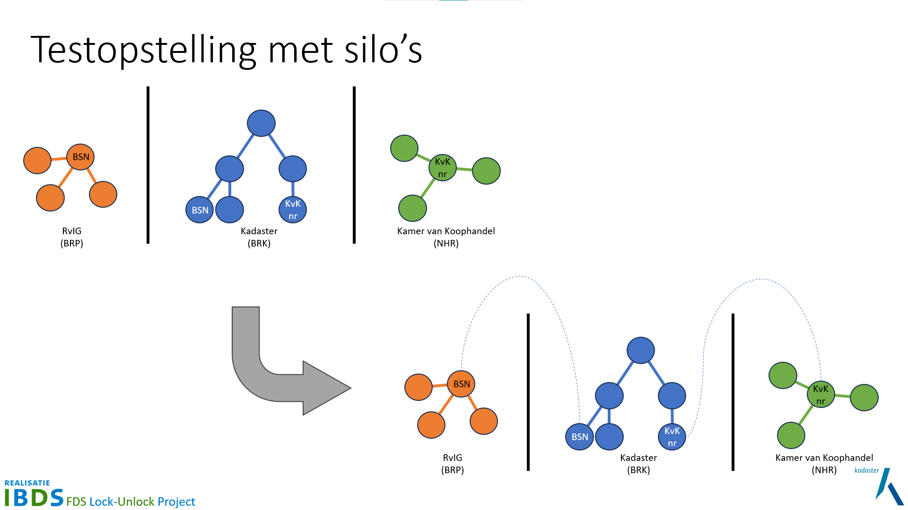

Om een federatieve bevraging te kunnen laten zien en om daarmee te kunnen onderzoeken, is een testopstelling nodig. De eerste stap in deze testopstelling was het creëren van het informatiemodel (zie vorige [sectie](./informatiemodel.md)) en de tweede stap is het creëren van testgegevens die aansluiten bij dit model. Deze datasets zijn gebruikt binnen dit project voor R&D en voor demonstratie doeleinden. 

Het gedefinieerde informatiemodel is een losjes uitgelijnde reeks schema's, aan elkaar gerelateerd door een upperontologie en gematerialiseerde relaties (zie [informatiekundige kern](./informatiekundigekern.md) en [informatiemodel](./informatie.md)). Voor elk van deze schema's worden testgegevens gemaakt die als een silo zijn gepubliceerd.

## Testdata genereren in silo's 

Test data voor alle registraties bestaan in eigen silo's. Dit is geheel naar werkelijkheid en zo hebben we ook onze testgegevens ontworpen. 

Voor de verschillende silo's is synthetische testdata gegenereerd. Hoewel de testgegevens zo worden gegenereerd dat deze in individuele silo's worden gepubliceerd, zijn relevante koppelsleutels al in de silo's opgenomen om ervoor te zorgen dat deze silo's op een federatieve manier kunnen worden bevraagd. Met deze opname hebben we ook het eerste doel van ons project bereikt (zie ook [Demonstrator](./demonstrator.md)).

// TODO testdata generator code in [testdata
repo](https://github.com/kadaster-labs/lock-unlock-testdata) zetten? :thinking_face:

||
| :--: |
|*Federatieve bevraging over silo's heen*|

De gegenereerde testgegevens worden in de <a href="https://github.com/kadaster-labs/lock-unlock-testdata" target="_blank">testdata repo</a> beschikbaar gesteld. Deze wordt automatisch geladen bij het opstarten van de containers van de [demonstrator](./demonstrator.md) (zie ook [testopstelling#deployment](./testopstelling.md#deployment)).

## Deployment

Als Kadaster hebben wij de BRK data zelf (uiteraard) en IMXGeo in huis. Ook de synthetische [testdata](#testdata) van de BRK hosten we op onze infrastructuur. Hiervoor maken we gebruik van ons interne Managed Application Platform, een <a href="https://kubernetes.io/"target="_blank">Kubernetes</a> / <a href="https://docs.openshift.com/" target="_blank">Open Shift</a> en <a href="https://www.redhat.com/en/topics/devops/what-is-gitops" target="_blank">GitOps</a> gebaseerd platform.

Voor de silo's die niet in het beheer van Kadaster zijn, te weten BRP, NHR en ANBI, zouden we die liever willen hosten op een andere cloud omgeving. Hiervoor maken we dankbaar gebruik van de mogelijkheden van de innovatiewerkplaats van de overheid, <a href="https://digilab.overheid.nl/" target="_blank">Digilab</a>.

Uiteindelijk ziet de deployment op basis van containers en GitOps er dan als volgt uit:

Links naar deployments:

> TO DO
> @marcvanandel ik (lexi) heb hier niet genoeg kennis. Pak jij deze op?

> - Linkjes fixen -> deel moet van Digilab zijn

- BRK -> <a href="https://brk.dst.test.cloud.kadaster.nl/"
  target="_blank">https://brk.dst.test.cloud.kadaster.nl/</a>
- ANBI -> <a href="https://anbi-lock-unlock.apps.digilab.network/"
  target="_blank">https://anbi-lock-unlock.apps.digilab.network/</a>
- BRP -> <a href="https://brp-lock-unlock.apps.digilab.network/"
  target="_blank">https://brp-lock-unlock.apps.digilab.network/</a>
- NHR -> <a href="https://nhr-lock-unlock.apps.digilab.network/"
  target="_blank">https://nhr-lock-unlock.apps.digilab.network/</a>
